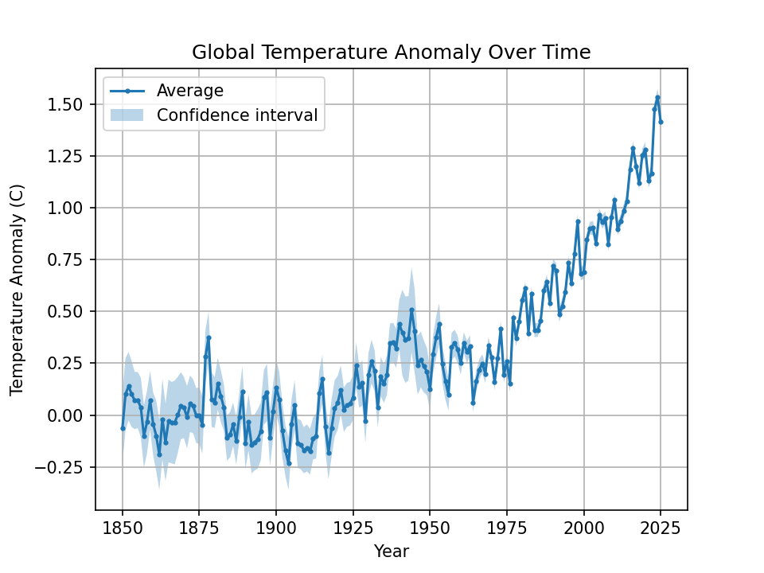
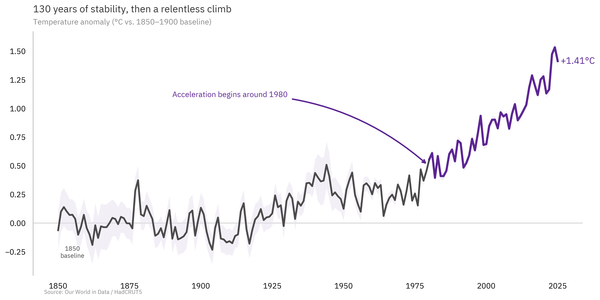
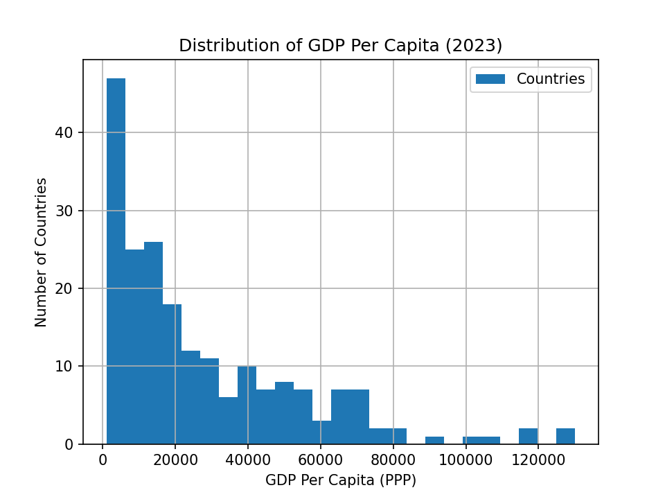
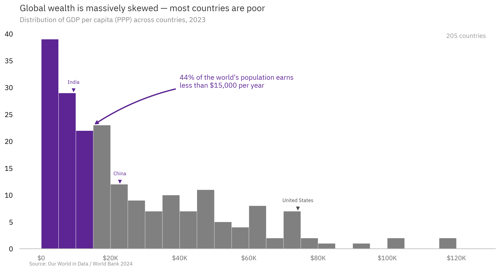
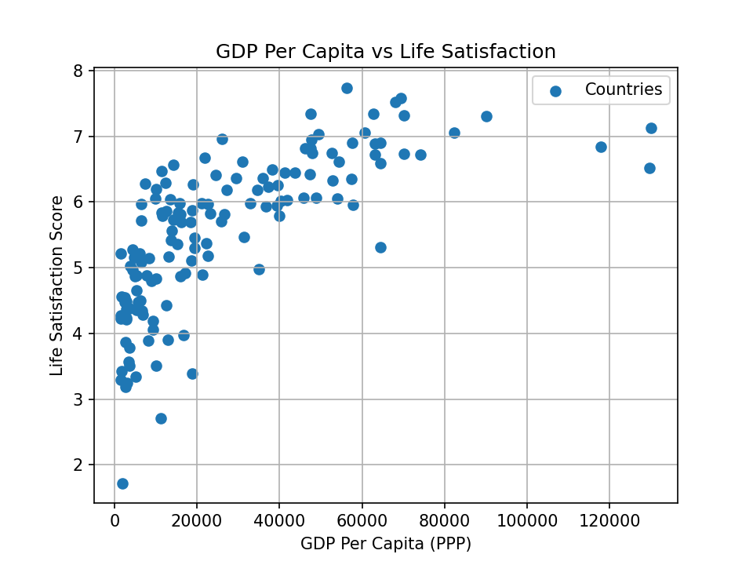
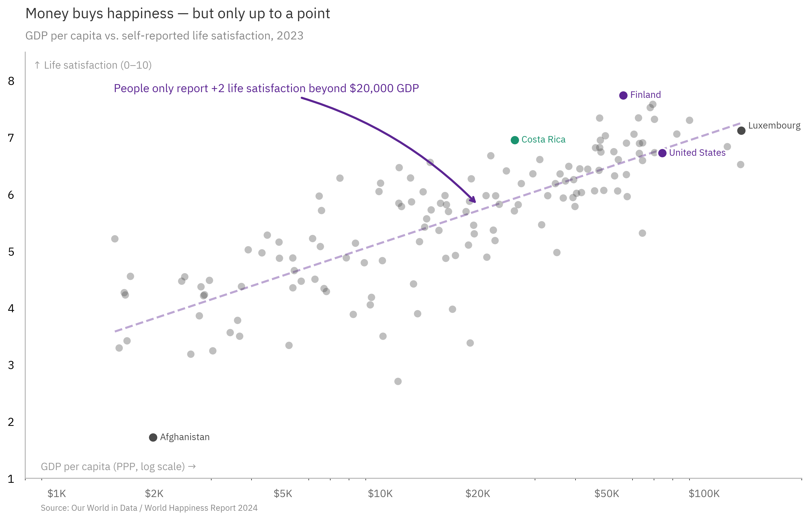
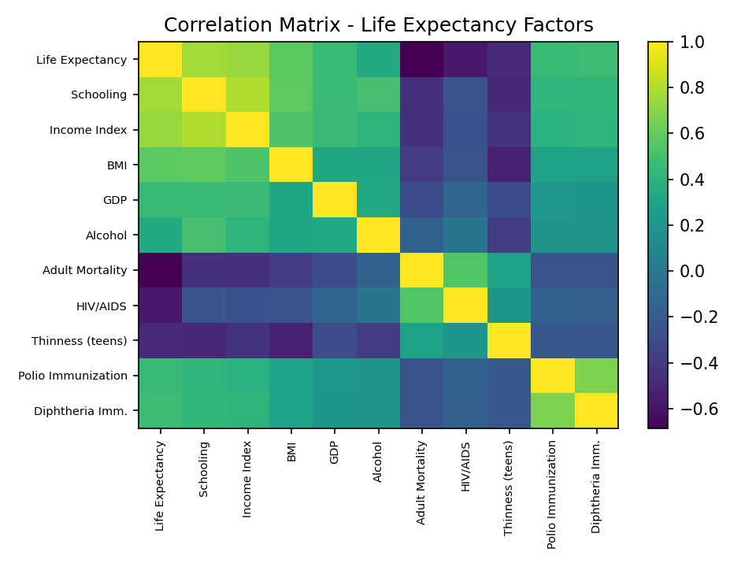
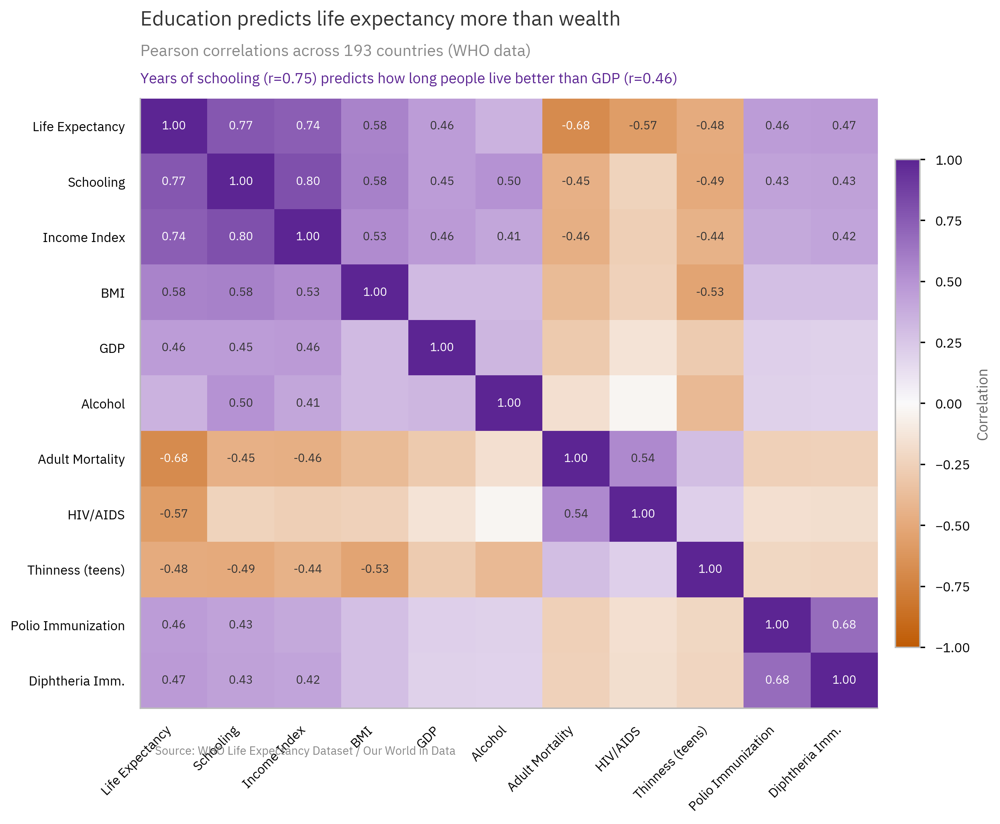
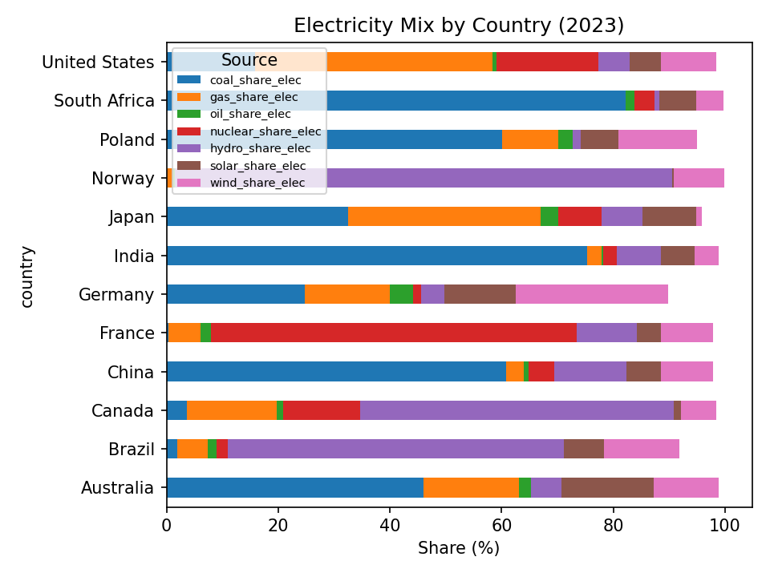
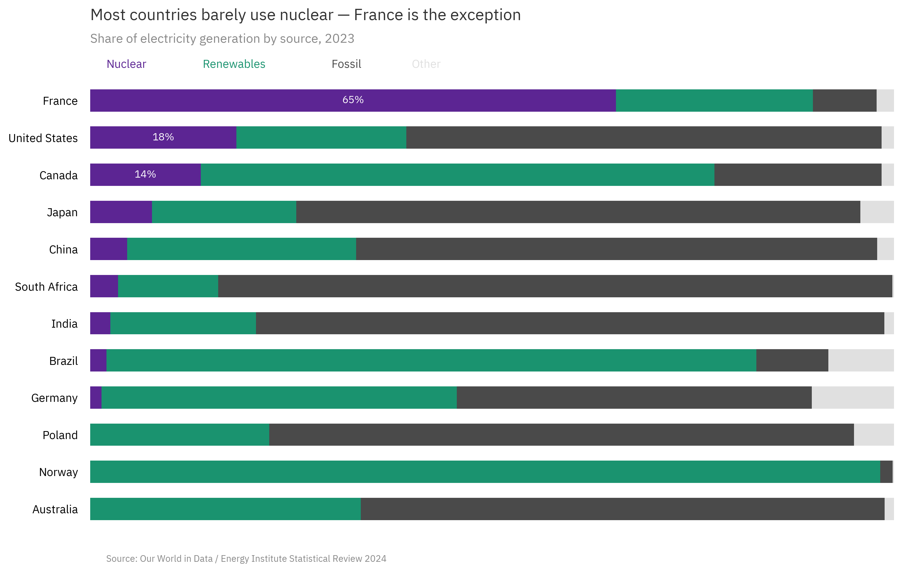

# StoryGraph Gallery

All 10 before/after pairs, organized by the type of transformation applied.

---

## Choose the Right Chart Type

Sometimes the fix isn't color or annotation — it's using a completely different chart structure.

### 01 — Big Number: Extreme Poverty

A bar chart of poverty over time vs. the one number that actually sticks: **130,000 people escaped extreme poverty every day.**

<table>
<tr><td><strong>Default matplotlib</strong></td><td><strong>With StoryGraph</strong></td></tr>
<tr>
<td></td>
<td></td>
</tr>
</table>

**What changed:** Bar chart replaced with a big number display. When one stat tells the whole story, skip the chart entirely.

---

### 04 — Slope Chart: Renewable Energy

A grouped bar chart forces the viewer to compare bar heights across clusters. A slope chart makes the *direction* and *magnitude* of change instantly visible.

<table>
<tr><td><strong>Default matplotlib</strong></td><td><strong>With StoryGraph</strong></td></tr>
<tr>
<td></td>
<td></td>
</tr>
</table>

**What changed:** Grouped bar → slope chart. Denmark's line rockets upward; Russia's flatlines. The angle *is* the story.

---

### 10 — Dumbbell Chart: Child Mortality

Grouped bars make you count heights. Dumbbells show the *journey* from 1990 to 2023 as a physical distance.

<table>
<tr><td><strong>Default matplotlib</strong></td><td><strong>With StoryGraph</strong></td></tr>
<tr>
<td></td>
<td></td>
</tr>
</table>

**What changed:** Grouped bar → dumbbell chart. The connecting lines show progress; the cluster at the top shows where it hasn't reached.

---

## Color the Story

Same chart type, but gray everything and color only what matters.

### 02 — Horizontal Bar: CO2 Emissions

Rainbow vertical bars with rotated labels → horizontal bars with two highlighted countries and an annotated ratio.

<table>
<tr><td><strong>Default matplotlib</strong></td><td><strong>With StoryGraph</strong></td></tr>
<tr>
<td></td>
<td></td>
</tr>
</table>

**What changed:** Vertical → horizontal (readable labels). Rainbow → gray + two colors. Added the "764x" ratio annotation — the number that makes the inequality real.

---

### 03 — Line Chart: Temperature Anomaly

A default line with markers on every point → a split-color line that shows the era of stability vs. the era of acceleration.

<table>
<tr><td><strong>Default matplotlib</strong></td><td><strong>With StoryGraph</strong></td></tr>
<tr>
<td></td>
<td></td>
</tr>
</table>

**What changed:** Removed markers, grid, and legend. Split the line at 1980: gray for the flat era, purple for the climb. Added inflection point annotation.

---

### 09 — Histogram: GDP Distribution

A default histogram → highlighted bins for the poverty cluster with a people-centered annotation.

<table>
<tr><td><strong>Default matplotlib</strong></td><td><strong>With StoryGraph</strong></td></tr>
<tr>
<td></td>
<td></td>
</tr>
</table>

**What changed:** Colored the below-$15K bins purple to separate the story from the context. Added country markers and a "44% of countries" annotation.

---

## Add Narrative Context

Same data, same basic shape — but annotations and design choices that tell the viewer *why it matters*.

### 05 — Scatter: GDP vs Happiness

Default scatter → log-scale scatter with trend line, highlighted countries, and a "diminishing returns" annotation.

<table>
<tr><td><strong>Default matplotlib</strong></td><td><strong>With StoryGraph</strong></td></tr>
<tr>
<td></td>
<td></td>
</tr>
</table>

**What changed:** Log scale reveals the diminishing returns curve. Highlighted outliers (Finland, Costa Rica, US) tell micro-stories. Annotation delivers the insight: "+2 life satisfaction beyond $20K."

---

### 06 — Heatmap: Life Expectancy Factors

Default viridis heatmap → diverging colormap with bold correlation values and a subtitle that delivers the insight.

<table>
<tr><td><strong>Default matplotlib</strong></td><td><strong>With StoryGraph</strong></td></tr>
<tr>
<td></td>
<td></td>
</tr>
</table>

**What changed:** Custom diverging colormap (orange-white-purple). Only strong correlations labeled. Subtitle calls out the finding: schooling (r=0.75) beats GDP (r=0.46).

---

### 07 — Dual Line: Russia Life Expectancy

Two plain lines with markers → gap shading, narrative markers, and a human-centered annotation about the 14-year gap.

<table>
<tr><td><strong>Default matplotlib</strong></td><td><strong>With StoryGraph</strong></td></tr>
<tr>
<td></td>
<td></td>
</tr>
</table>

**What changed:** Removed markers, grid, and legend box. Added gap shading between the lines. Soviet collapse marked with a dashed line. Annotation frames it in human terms: "Russian men lived only 57 years."

---

### 08 — Stacked Bar: Electricity Mix

Seven rainbow segments with a legend box → three grouped categories with nuclear as the story.

<table>
<tr><td><strong>Default matplotlib</strong></td><td><strong>With StoryGraph</strong></td></tr>
<tr>
<td></td>
<td></td>
</tr>
</table>

**What changed:** Collapsed 7 source types into 4 categories. Nuclear (purple) goes first so the eye can compare across all countries. France's 65% label does the talking. Sorted by nuclear share to match the narrative axis.
