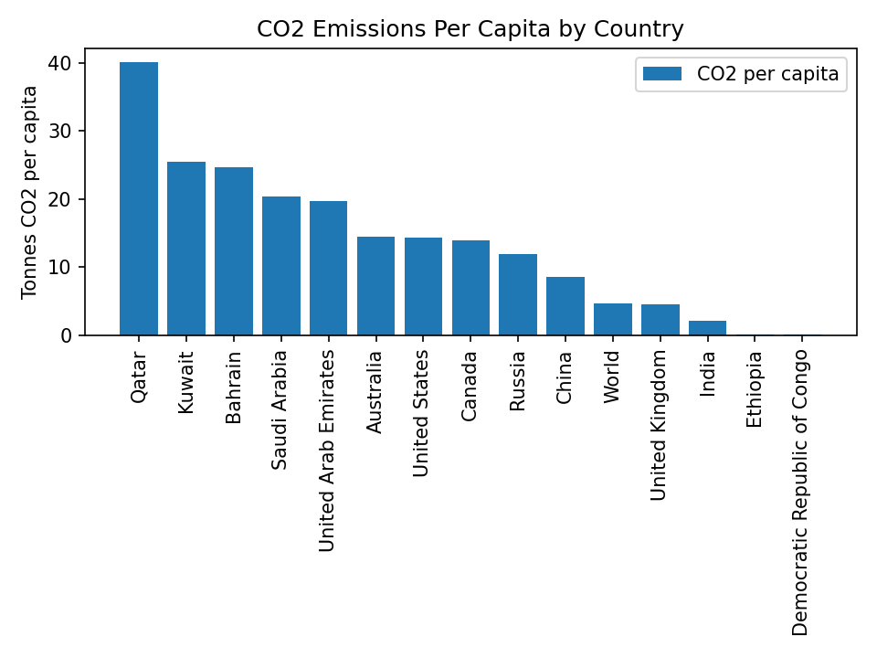
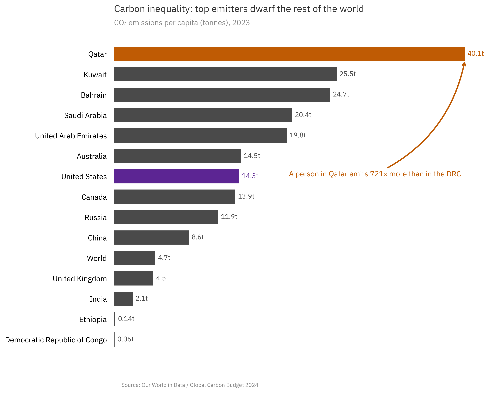
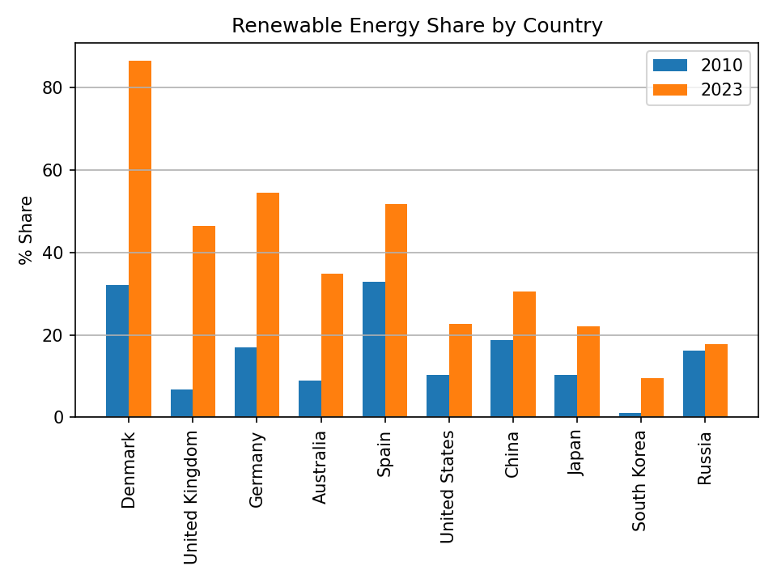
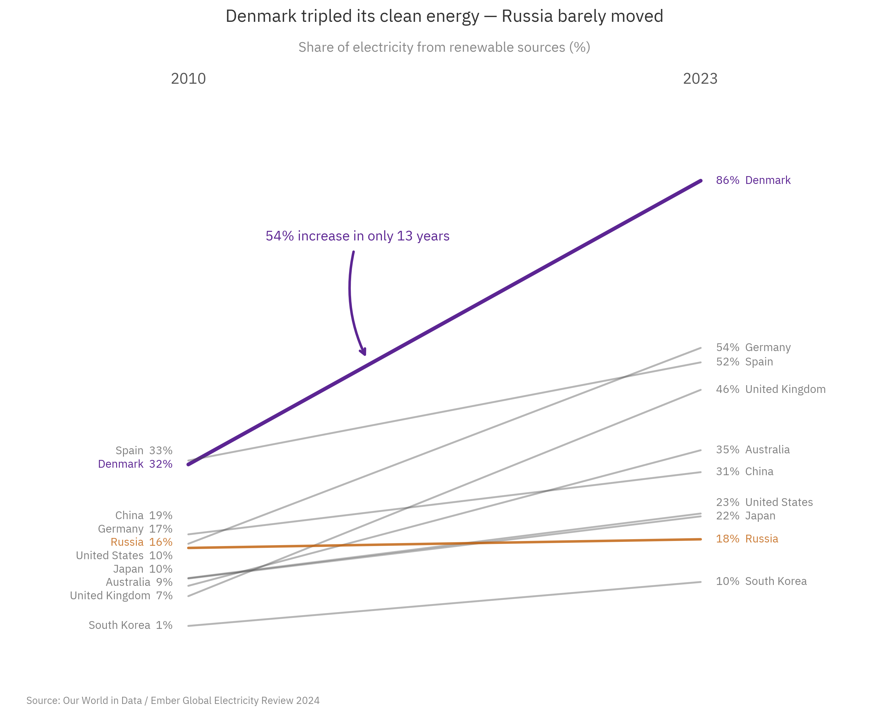
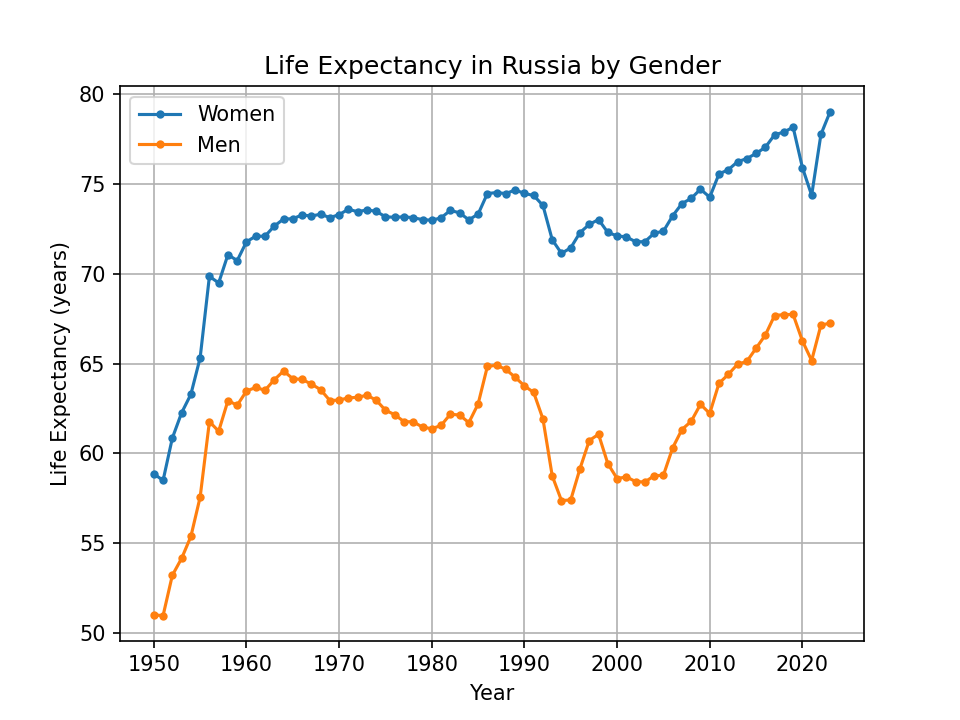
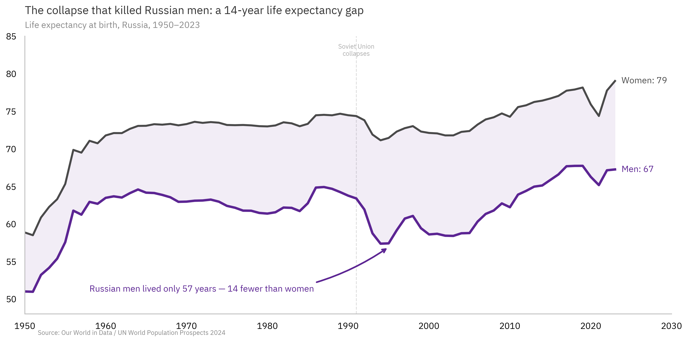
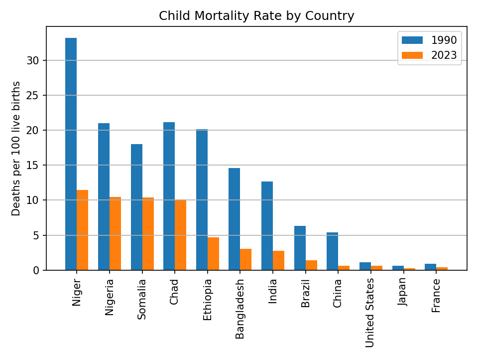
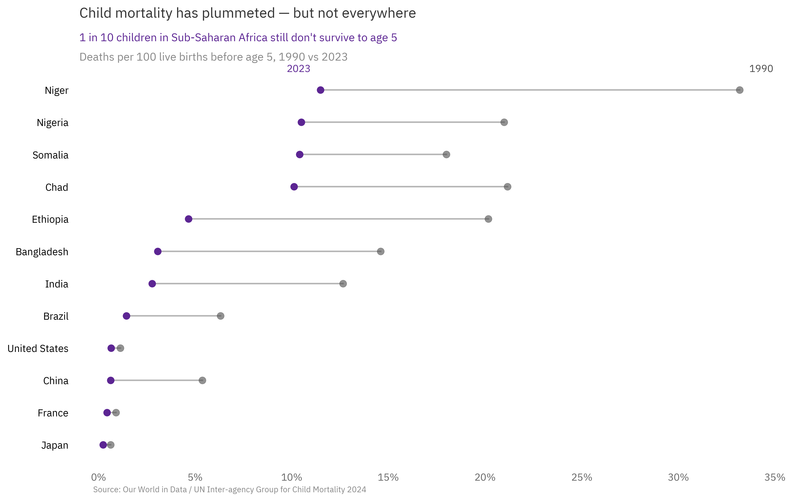
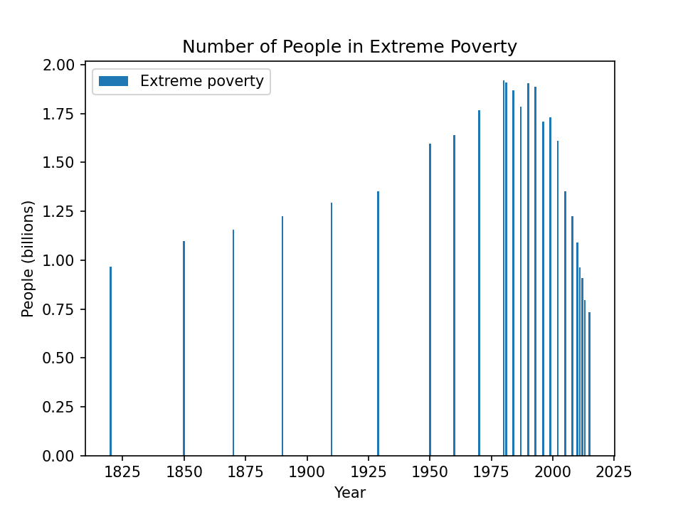
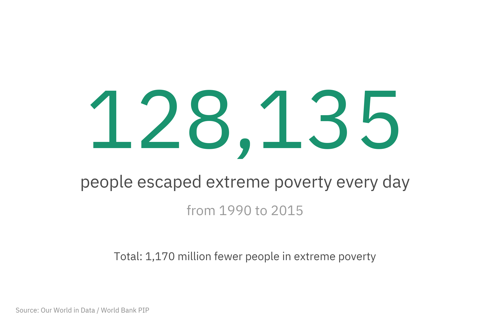

# StoryGraph

**A data storytelling toolkit for matplotlib.** Turn default charts into visual arguments.

<table>
<tr><td><strong>Default matplotlib</strong></td><td><strong>With StoryGraph</strong></td></tr>
<tr>
<td></td>
<td></td>
</tr>
</table>

---

## The Problem

Default matplotlib produces charts that *show* data but don't *tell* stories. Every chart comes out with rainbow colors, framed legends, rotated labels, and a descriptive title like "CO2 Emissions by Country." The viewer has to do all the thinking.

StoryGraph flips that. Gray everything, color the story, title the insight, annotate the "why." The viewer gets the point in two seconds.

---

## Gallery

<table>
<tr><td><strong>Default matplotlib</strong></td><td><strong>With StoryGraph</strong></td></tr>
<tr>
<td></td>
<td></td>
</tr>
<tr><td colspan="2"><em>Grouped bar chart &rarr; slope chart. The structure change alone tells the story of movement over time.</em></td></tr>
</table>

<table>
<tr><td><strong>Default matplotlib</strong></td><td><strong>With StoryGraph</strong></td></tr>
<tr>
<td></td>
<td></td>
</tr>
<tr><td colspan="2"><em>Two plain lines &rarr; gap shading, narrative markers, and a human-centered annotation.</em></td></tr>
</table>

<table>
<tr><td><strong>Default matplotlib</strong></td><td><strong>With StoryGraph</strong></td></tr>
<tr>
<td></td>
<td></td>
</tr>
<tr><td colspan="2"><em>Grouped bar chart &rarr; dumbbell chart. Progress becomes visible at a glance.</em></td></tr>
</table>

<table>
<tr><td><strong>Default matplotlib</strong></td><td><strong>With StoryGraph</strong></td></tr>
<tr>
<td></td>
<td></td>
</tr>
<tr><td colspan="2"><em>A bar chart of poverty data &rarr; the one number that matters: 130,000 people per day.</em></td></tr>
</table>

See all 10 before/after pairs in the **[Full Gallery](GALLERY.md)**.

---

## Quick Start

```bash
git clone https://github.com/your-username/storygraph.git
cd storygraph
pip install -r requirements.txt
```

```python
import matplotlib.pyplot as plt
import sys, os

sys.path.insert(0, os.path.join('austin_style_kit'))
plt.style.use(os.path.join('austin_style_kit', 'my_notebook.mplstyle'))
from austin_annotations import PALETTE, annotate, add_source_note

# Gray everything, color the story
fig, ax = plt.subplots(figsize=(10, 6))
values = [12, 8, 45, 6, 3]
colors = [PALETTE['neutral']] * len(values)
colors[2] = PALETTE['primary']  # highlight the story
ax.barh(range(len(values)), values, color=colors)
plt.show()
```

---

## The Three Rules

Every chart follows three hard rules:

1. **Maximum 3 colors per graph.** Gray for context, one color for the story, one more only if needed.
2. **Exactly 1 key insight per graph.** Delivered via arrow annotation, colored subtitle, or the title itself.
3. **Accent color (gold) is reserved.** Only for genuinely shocking or urgent information. Most charts never use it.

---

## Chart Type Selection

| Question | Chart Type | Notes |
|---|---|---|
| 1-2 numbers | Big text display | No chart needed |
| Compare categories | Horizontal bar | Never pie charts |
| Trend over time | Line chart | Annotate inflection points |
| Before/after (few series) | Slope chart | Connect start to end |
| Before/after (many categories) | Dumbbell chart | Dots connected by lines |
| Relationship | Scatter | Add trend line if useful |
| Part of whole | Stacked horizontal bar | Sort by story metric |
| Distribution | Histogram | Keep it simple |
| Matrix/correlation | Heatmap | Use `austin_diverging` colormap |

---

## The Palette

```python
PALETTE = {
    'primary':   '#5C2593',  # Deep purple  - main data, key callouts
    'secondary': '#0A5E73',  # Dark teal    - second series
    'negative':  '#BF5B04',  # Deep orange  - bad news, decreases
    'positive':  '#1A936F',  # Sea green    - good news, increases
    'neutral':   '#4A4A4A',  # Dark gray    - context, de-emphasized
    'accent':    '#E8B72C',  # Bright gold  - reserved for shock value
}
```

---

## Font Note

The style file uses **IBM Plex Sans** for an exact match. Charts will render fine with any sans-serif font if IBM Plex Sans isn't installed.

Install it from [Google Fonts](https://fonts.google.com/specimen/IBM+Plex+Sans) or skip it — the toolkit works either way.

---

## Project Structure

```
storygraph/
├── austin_style_kit/       # Style files, annotations, colormaps
│   ├── my_notebook.mplstyle
│   ├── austin_presentation.mplstyle
│   ├── austin_annotations.py
│   └── austin_colormaps.py
├── datasets/               # CSV data files (Our World in Data)
├── graphs/                 # 10 polished example charts
│   └── ugly/               # 10 default matplotlib versions
├── CLAUDE.md               # AI assistant instructions
├── GALLERY.md              # All 10 before/after pairs
└── storytelling_data.md    # Methodology guide
```

---

## License

MIT
